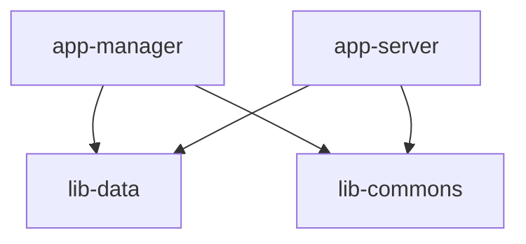

> 本篇文章主要介绍如何利用Gradle将SpringBoot项目拆分成多个模块的

### 模块划分

一个项目可能有如下几个模块：

- **lib-commons** 公用模块，里面有一些工具类和常用父类等等
- **lib-data** 数据模块，里面可能有Entity和数据库查询操作
- **app-server** 服务端，可以启动的SpringBoot应用
- **app-manager** 管理端，可以启动的SpringBoot应用

依赖关系如下：



### 项目创建

使用[https://start.spring.io/](https://start.spring.io/)可以很方便地创建一个SpringBoot应用

首先，创建一个空的SpringBoot项目：


目录结构如下：


删除`build.gradle`和`src/`目录；

在根目录下建立4个文件夹`lib-commons`，`lib-data`,`app-server`,`app-manager`，并在`settings.gradle`中引入；

```gradle
rootProject.name = 'demo'

include 'lib-commons'
include 'lib-data'
include 'app-server'
include 'app-manager'
```

分别在这四个模块中新建`build.gradle`文件；

重点讲一下`lib-commons`中的`build.gradle`；

再次使用[https://start.spring.io/](https://start.spring.io/)创建一个SpringBoot应用，这次我们加上一些`Dependencies`，选择哪些`Dependencies`取决于该模块的功能及其需要的API；

例如在`lib-commons`中，我们会定义统一的RestFul API的Json格式，就可以添加`Spring Web`；

生成的`build.gradle`脚本如下：

```gradle
plugins {
  id 'org.springframework.boot' version '2.2.6.RELEASE'
  id 'io.spring.dependency-management' version '1.0.9.RELEASE'
  id 'java'
}
group = 'com.example'
version = '0.0.1-SNAPSHOT'
sourceCompatibility = '1.8'
repositories {
  mavenCentral()
}
dependencies {
  implementation 'org.springframework.boot:spring-boot-starter-web'
  testImplementation('org.springframework.boot:spring-boot-starter-test') {
    exclude group: 'org.junit.vintage', module: 'junit-vintage-engine'
  }
}
test {
  useJUnitPlatform()
}
```

由于此模块是作为lib被其他模块引用的，无需作为SpringBoot应用启动，我们需要在此脚本基础上做一些修改，确保编译时不会出现**由于缺少主类，执行bootJar任务时错误**的问题；

只需要两步修改就能解决上述问题：

1. 删除插件：`id 'org.springframework.boot' version '2.2.6.RELEASE'`，此插件包含了`bootJar`和`bootRun`任务，此时会导致所有SpringBoot的Dependencies无法加载

2. 添加下面这段代码：

```gradle
dependencyManagement {
  imports {
    mavenBom("org.springframework.boot:spring-boot-dependencies:2.2.6.RELEASE")
    // 版本号2.2.6.RELEASE和上面删除的org.springframework.boot插件版本一致
  }
}
```

最终成了这样：

```gradle
plugins {
  // id 'org.springframework.boot' version '2.2.6.RELEASE'
  id 'io.spring.dependency-management' version '1.0.9.RELEASE'
  id 'java'
}
group = 'com.example'
version = '0.0.1-SNAPSHOT'
sourceCompatibility = '1.8'
repositories {
  mavenCentral()
}
// SpringBoot 2.2.6.RELEASE
dependencyManagement {
  imports {
    mavenBom("org.springframework.boot:spring-boot-dependencies:2.2.6.RELEASE")
  }
}
dependencies {
  implementation 'org.springframework.boot:spring-boot-starter-web'
  testImplementation('org.springframework.boot:spring-boot-starter-test') {
    exclude group: 'org.junit.vintage', module: 'junit-vintage-engine'
  }
}
test {
  useJUnitPlatform()
}
```

至此`lib-commons`的配置已经完成；

`lib-data`与`lib-commons`类似，可以选择不同的Dependencies；例如：

```gradle
plugins {
  id 'org.springframework.boot' version '2.2.6.RELEASE'
  id 'io.spring.dependency-management' version '1.0.9.RELEASE'
  id 'java'
}
group = 'com.example'
version = '0.0.1-SNAPSHOT'
sourceCompatibility = '1.8'
configurations {
  compileOnly {
    extendsFrom annotationProcessor
  }
}
repositories {
  mavenCentral()
}
dependencies {
  implementation 'org.springframework.boot:spring-boot-starter-data-jpa'
  compileOnly 'org.projectlombok:lombok'
  annotationProcessor 'org.projectlombok:lombok'
  testImplementation('org.springframework.boot:spring-boot-starter-test') {
    exclude group: 'org.junit.vintage', module: 'junit-vintage-engine'
  }
}
test {
  useJUnitPlatform()
}
```

`app-server`和`app-manager`，作为SpringBoot应用，无需像`lib-data`和`lib-commons`一样修改`build.gradle`，添加`lib-data`和`lib-commons`中包含的所有Dependencies，
并引入模块；

```gradle
plugins {
  id 'org.springframework.boot' version '2.2.6.RELEASE'
  id 'io.spring.dependency-management' version '1.0.9.RELEASE'
  id 'java'
}
group = 'com.example'
version = '0.0.1-SNAPSHOT'
sourceCompatibility = '1.8'
configurations {
  compileOnly {
    extendsFrom annotationProcessor
  }
}
repositories {
  mavenCentral()
}
dependencies {
  implementation project(':lib.commons') // 引入lib.commons
  implementation project(':lib.data') // 引入lib.data
  implementation 'org.springframework.boot:spring-boot-starter-data-jpa'
  implementation 'org.springframework.boot:spring-boot-starter-web'
  compileOnly 'org.projectlombok:lombok'
  runtimeOnly 'mysql:mysql-connector-java'
  annotationProcessor 'org.projectlombok:lombok'
  testImplementation('org.springframework.boot:spring-boot-starter-test') {
    exclude group: 'org.junit.vintage', module: 'junit-vintage-engine'
  }
}
test {
  useJUnitPlatform()
}
```